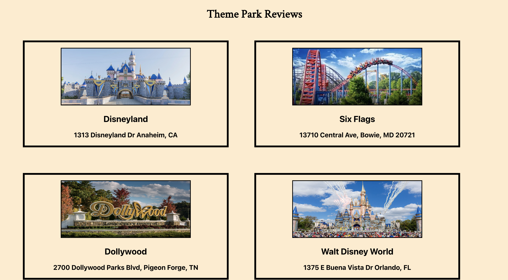
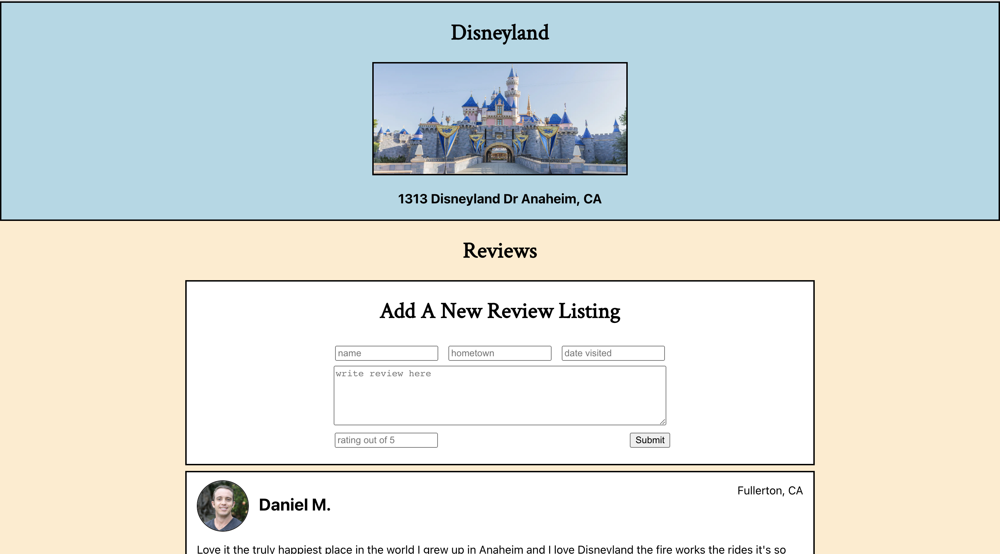
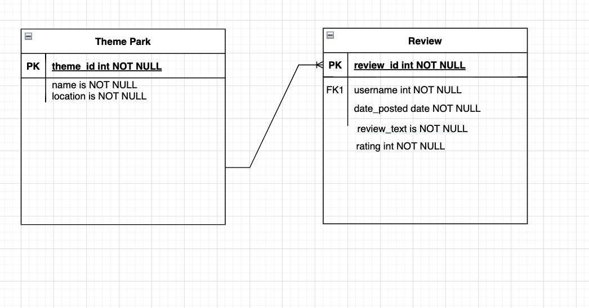
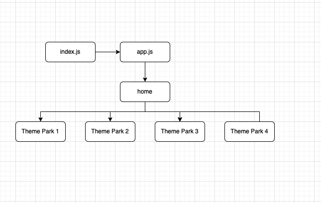
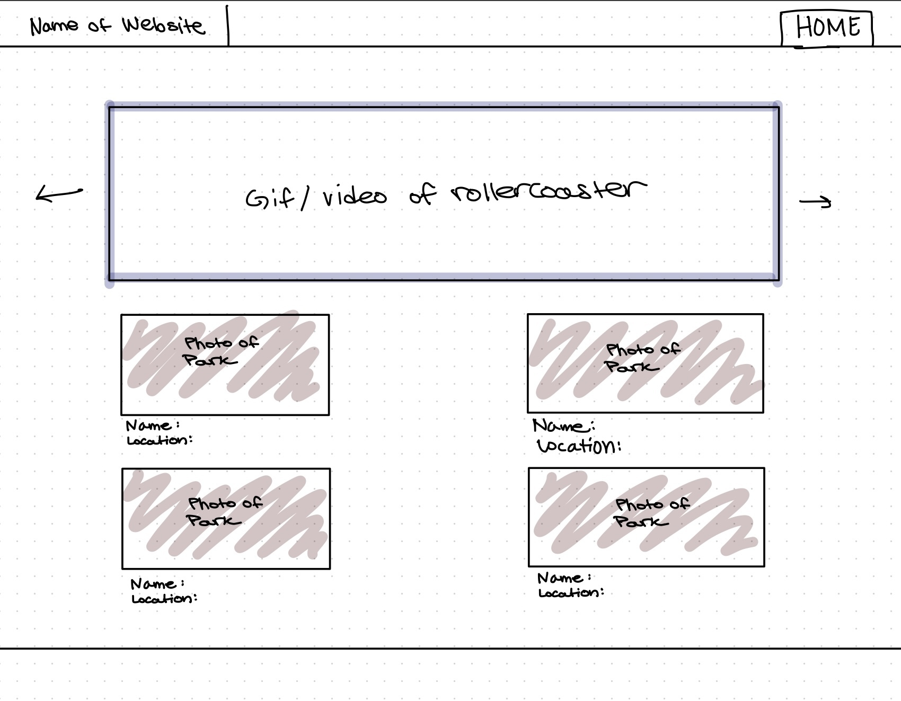
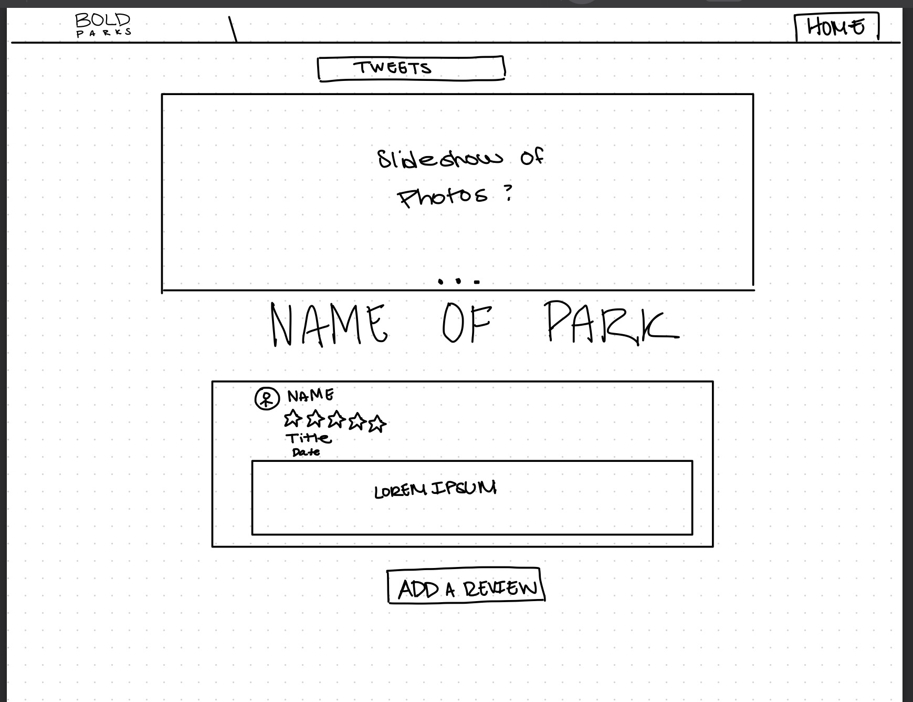

# Full Stackathon: Theme Park Review Website

## Date: 07/22/2022

#### By: Anaflavia Almendras, Avery Novick, and Yangtsel Sherap

**[Deployed Website](ADD HEROKU LINK HERE) **

---

---

#### _Description_

For this ==Hackathon==, our group was tasked with creating a theme park themed Full Stack Application in a day and a half by incorporating a ==React frontend, a MongoDB database, and a Mongoose/Express backend.==

We created a Theme Park Review Website that includes real Yelp reviews for the following parks:

- Disneyworld
- Disneyland
- Six Flags
- Dollywood

Our website also includes a feature that allows users to write their own review for any of the listed parks. View the project [here](ENTER HERUKO LINK).

###### _Deployed Homepage_

###### _Deployed Review Page_

---

#### _Technologies Used_

- React.js
- MongoDB
- Mongoose/Express
- Javascript
- Node.js
- CSS
- HTML
- Heroku
- Atlas

---

#### _Project Overview_

Once the user lands on the home page of Theme Park reviews, they can select from the four theme park cards shown to leave their honest review of their visit or simply to checkout other reviews. Once at the theme park page they can add a review by listing their name, hometown, date, rating and their opinions about the park. The review will be added to the bottom of the list. The user can also click on the park image at the very top and it will redirected them to the parks main website.

We created an Entity Relationship Diagram and Component Hierarchy Diagram shown in the screenshots section.

---

### **_Screenshots_**

#### **Entity Relationship Diagram**

#### **Component Hierarchy Diagram**

#### **Preliminary Layouts of Blog**

## 

---

#### _Future Updates_

- [x] Replace numerical review rating with star emoticons
- [x] Include a stock photo for every new review
- [ ] Give reviewers the ability to attach their own photo/video
- [ ] Use Yelp's API
- [ ] Add live tweets

---

#### **_Resources_**

- Draw.io
- Heroku

---

<!--

# Getting Started with Create React App

This project was bootstrapped with [Create React App](https://github.com/facebook/create-react-app).

## Available Scripts

In the project directory, you can run:

### `npm start`

Runs the app in the development mode.\
Open [http://localhost:3000](http://localhost:3000) to view it in your browser.

The page will reload when you make changes.\
You may also see any lint errors in the console.

### `npm test`

Launches the test runner in the interactive watch mode.\
See the section about [running tests](https://facebook.github.io/create-react-app/docs/running-tests) for more information.

### `npm run build`

Builds the app for production to the `build` folder.\
It correctly bundles React in production mode and optimizes the build for the best performance.

The build is minified and the filenames include the hashes.\
Your app is ready to be deployed!

See the section about [deployment](https://facebook.github.io/create-react-app/docs/deployment) for more information.

### `npm run eject`

**Note: this is a one-way operation. Once you `eject`, you can't go back!**

If you aren't satisfied with the build tool and configuration choices, you can `eject` at any time. This command will remove the single build dependency from your project.

Instead, it will copy all the configuration files and the transitive dependencies (webpack, Babel, ESLint, etc) right into your project so you have full control over them. All of the commands except `eject` will still work, but they will point to the copied scripts so you can tweak them. At this point you're on your own.

You don't have to ever use `eject`. The curated feature set is suitable for small and middle deployments, and you shouldn't feel obligated to use this feature. However we understand that this tool wouldn't be useful if you couldn't customize it when you are ready for it.

## Learn More

You can learn more in the [Create React App documentation](https://facebook.github.io/create-react-app/docs/getting-started).

To learn React, check out the [React documentation](https://reactjs.org/).

### Code Splitting

This section has moved here: [https://facebook.github.io/create-react-app/docs/code-splitting](https://facebook.github.io/create-react-app/docs/code-splitting)

### Analyzing the Bundle Size

This section has moved here: [https://facebook.github.io/create-react-app/docs/analyzing-the-bundle-size](https://facebook.github.io/create-react-app/docs/analyzing-the-bundle-size)

### Making a Progressive Web App

This section has moved here: [https://facebook.github.io/create-react-app/docs/making-a-progressive-web-app](https://facebook.github.io/create-react-app/docs/making-a-progressive-web-app)

### Advanced Configuration

This section has moved here: [https://facebook.github.io/create-react-app/docs/advanced-configuration](https://facebook.github.io/create-react-app/docs/advanced-configuration)

### Deployment

This section has moved here: [https://facebook.github.io/create-react-app/docs/deployment](https://facebook.github.io/create-react-app/docs/deployment)

### `npm run build` fails to minify

This section has moved here: [https://facebook.github.io/create-react-app/docs/troubleshooting#npm-run-build-fails-to-minify](https://facebook.github.io/create-react-app/docs/troubleshooting#npm-run-build-fails-to-minify) -->
